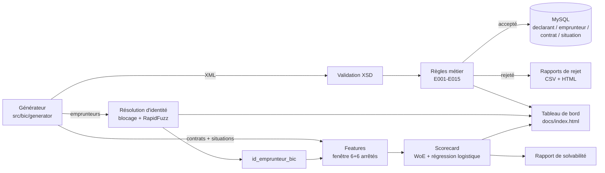

# uemoa-credit-bureau-pipeline

[](https://github.com/blakro/uemoa-credit-bureau-pipeline/actions/workflows/ci.yml)

Simulation de bout en bout du pipeline de déclaration à un Bureau
d'Information sur le Crédit (BIC) de la zone UEMOA : validation
déclarative, résolution d'identité et scoring de solvabilité.

*End-to-end simulation of a credit bureau (BIC) reporting pipeline for
the UEMOA region: declaration validation, identity resolution, and
credit scoring.*

> ⚠️ **Données 100 % synthétiques.** Aucun établissement réel, aucune
> personne réelle. Voir [`DISCLAIMER.md`](DISCLAIMER.md).
> *All data is 100% synthetic — no real institution, no real person. See
> [`DISCLAIMER.md`](DISCLAIMER.md).*

---

## Français

### Le problème métier

Un Bureau d'Information sur le Crédit centralise les encours de crédit
déclarés chaque mois par les banques, établissements financiers et SFD
d'une région, afin de donner à chaque prêteur une vue complète de
l'endettement d'un emprunteur — au-delà de ses propres livres. Ce service
n'a de valeur que si les données reçues sont **fiables** (formats
respectés, montants cohérents) et **consolidées** (un même client déclaré
par trois banques sous trois orthographes ne doit compter qu'une fois).
La qualité déclarative est donc l'enjeu central d'un BIC : c'est ce que ce
projet simule et mesure de bout en bout.

### Architecture



### Résultats chiffrés

| Module | Métrique | Résultat |
|---|---|---|
| Moteur de validation (XSD + règles) | Rappel sur la vérité-terrain d'anomalies | **99,8 %** (2 477 / 2 481 anomalies injectées détectées, seuil visé ≥ 95 %) |
| Résolution d'identité | Précision de l'appariement | **100 %** (0 faux positif sur l'échantillon évalué, seuil visé ≥ 95 %) |
| Scorecard de solvabilité | AUC / Gini / KS | **0,664 / 0,328 / 0,298** |

Le détail par code d'erreur (matrice de rappel) s'affiche en exécutant
`pytest -s tests/test_engine_recall.py`. Ces chiffres sont recalculés à
chaque exécution de `scripts/run_pipeline.py` et alimentent le tableau de
bord.

### Tableau de bord en ligne

Une fois GitHub Pages activé sur `/docs` : **https://blakro.github.io/uemoa-credit-bureau-pipeline/**

### Stack et comment rejouer

Python 3.11 · SQLAlchemy 2.x (MySQL, PyMySQL) · lxml (XSD) · pandas ·
RapidFuzz · scikit-learn · pytest · Chart.js (dashboard statique, CDN).

```bash
pip install -e ".[dev]"
pytest                                    # tests unitaires (MySQL non requis)
python scripts/run_pipeline.py --seed 42  # pipeline complet -> docs/data/dashboard.json
python -m bic.scoring --report <id_emprunteur_bic>  # rapport de solvabilité
```

`MYSQL_HOST` est optionnel : sans base disponible, le pipeline valide et
score les données sans les charger en base (c'est le cas dans un sandbox
de développement). MySQL n'est utilisé qu'en intégration continue
(service container GitHub Actions).

### Limites assumées et pistes d'extension

- **Fenêtre de scoring unique** : avec 12 arrêtés générés, les fenêtres
  d'observation/performance (6 + 6 mois) ne produisent qu'une seule coupe
  temporelle par emprunteur, pas un panel glissant. Extension naturelle :
  générer davantage d'arrêtés pour un design de panel classique.
- **Blocage phonétique simplifié** : `identity/blocking.py` utilise une
  clé phonétique maison plutôt qu'un métaphone complet, pour rester dans
  la stack imposée sans dépendance supplémentaire.
- **Chargement en base optionnel** : le scoring et le dashboard opèrent
  sur les objets Python générés en mémoire plutôt que sur une relecture
  depuis MySQL, pour rester exécutables sans base disponible.
- **Scorecard volontairement simple** : 9 variables, binning par
  quantiles. Une version production affinerait le binning (arbre de
  décision par variable) et ajouterait une validation croisée.

---

## English

### The business problem

A Credit Information Bureau (BIC) centralizes monthly credit exposure
reported by banks, financial institutions, and microfinance institutions
across a region, giving every lender a full picture of a borrower's debt
— beyond their own books. This is only valuable if incoming data is
**reliable** (correct formats, coherent amounts) and **consolidated**
(the same customer reported by three banks under three spellings should
count once). Declarative data quality is therefore the central challenge
of a BIC — this project simulates and measures it end to end.

### Architecture

See the Mermaid diagram above (language-agnostic).

### Results

| Module | Metric | Result |
|---|---|---|
| Validation engine (XSD + business rules) | Recall on ground-truth anomalies | **99.8%** (2,477 / 2,481 injected anomalies detected, target ≥ 95%) |
| Identity resolution | Matching precision | **100%** (0 false positive on the evaluated sample, target ≥ 95%) |
| Solvency scorecard | AUC / Gini / KS | **0.664 / 0.328 / 0.298** |

### Live dashboard

Once GitHub Pages is enabled on `/docs`: **https://blakro.github.io/uemoa-credit-bureau-pipeline/**

### Stack and how to replay

Python 3.11 · SQLAlchemy 2.x (MySQL, PyMySQL) · lxml (XSD) · pandas ·
RapidFuzz · scikit-learn · pytest · Chart.js (static dashboard, via CDN).

```bash
pip install -e ".[dev]"
pytest                                    # unit tests (no MySQL required)
python scripts/run_pipeline.py --seed 42  # full pipeline -> docs/data/dashboard.json
python -m bic.scoring --report <id_emprunteur_bic>  # solvency report
```

`MYSQL_HOST` is optional: without a database available, the pipeline
still validates and scores the data, just without loading it into a
database (the case in a development sandbox). MySQL is only exercised in
CI (GitHub Actions service container).

### Known limitations and extension ideas

- **Single scoring window**: with 12 generated snapshots, the 6+6-month
  observation/performance windows produce one time cut per borrower
  rather than a rolling panel. Natural extension: generate more
  snapshots for a classic panel design.
- **Simplified phonetic blocking**: `identity/blocking.py` uses a
  homemade phonetic key rather than a full metaphone implementation, to
  stay within the imposed stack without an extra dependency.
- **Optional database loading**: scoring and the dashboard operate on
  the in-memory generated Python objects rather than re-reading from
  MySQL, so the pipeline stays runnable without a database.
- **Deliberately simple scorecard**: 9 variables, quantile binning. A
  production version would refine the binning (per-variable decision
  tree) and add cross-validation.
