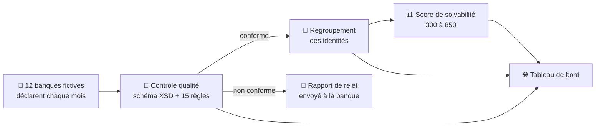

<div align="center">

# Centrale des risques — simulation d'un pipeline de crédit

**Comment une centrale des risques transforme les fichiers bruts envoyés par les banques
en un score de solvabilité fiable.**

[](https://github.com/blakro/uemoa-credit-bureau-pipeline/actions/workflows/ci.yml)
[](https://blakro.github.io/uemoa-credit-bureau-pipeline/)
[](https://www.python.org/)
[](LICENSE)

### 👉 **[Voir le tableau de bord en ligne](https://blakro.github.io/uemoa-credit-bureau-pipeline/)**

</div>

> [!WARNING]
> **Données entièrement fictives.** Les banques, les clients et les crédits de ce projet sont
> générés par un programme. Aucun établissement réel, aucune personne réelle.
> Voir [`DISCLAIMER.md`](DISCLAIMER.md).

---

## Le problème, en deux minutes

Imaginons **Awa**. Elle a un crédit auto dans une première banque, un découvert dans une
deuxième, et un microcrédit dans une troisième. Chacune ne voit que sa propre créance : chacune
croit qu'Awa n'a qu'une seule dette, gérable.

Une **centrale des risques** existe pour résoudre exactement ce problème. Chaque mois, toutes
les banques d'un pays lui envoient la liste de leurs crédits en cours. Elle recolle les
morceaux et renvoie à chaque prêteur une vue complète de l'endettement de son client.

Cela paraît simple. Deux obstacles rendent la tâche difficile :

| L'obstacle | Ce qui se passe concrètement |
|---|---|
| 🧹 **Les fichiers sont sales** | Dates impossibles (`31/02/2024`), montants en texte (`N/A`), encours négatifs, devises interdites, crédits rattachés à un client qui n'existe pas. |
| 🔀 **Le même client s'écrit de dix façons** | `Aïchatou CISSÉ` chez l'une, `AICHATOU CISSE` chez l'autre, `CISSE A.` chez la troisième, avec une date de naissance décalée d'un jour. |

Si l'on ne nettoie pas, on charge des données fausses. Si l'on ne regroupe pas, la dette d'Awa
reste invisible et on continue de lui prêter. **Ce dépôt simule la chaîne complète qui traite
ces deux problèmes, puis mesure sa propre performance.**

---

## Ce que fait le pipeline



| Étape | Ce qui se passe | Module |
|---|---|---|
| **1. Générer** | Fabrique 12 banques fictives et leurs déclarations mensuelles, en y **glissant volontairement des erreurs** dont il garde la liste exacte. | [`generator/`](src/bic/generator) |
| **2. Contrôler** | Vérifie le format du fichier, puis 15 règles métier. Chaque ligne est acceptée, acceptée sous réserve, ou rejetée — avec un message expliquant **comment corriger**. | [`validation/`](src/bic/validation) |
| **3. Regrouper** | Rapproche les fiches qui désignent la même personne malgré les différences d'orthographe, et leur attribue un identifiant unique. | [`identity/`](src/bic/identity) |
| **4. Noter** | Construit un score de solvabilité à partir de l'historique de paiement, selon la méthode des grilles de score utilisée en banque. | [`scoring/`](src/bic/scoring) |

L'astuce qui rend le projet mesurable : **le générateur sait exactement quelles erreurs il a
introduites et quels clients sont en réalité la même personne.** On peut donc noter le pipeline
sur sa propre copie, sans jamais s'auto-évaluer à l'aveugle.

---

## Résultats mesurés

Ces chiffres ne sont pas saisis à la main : ils sont **recalculés à chaque exécution** par
`scripts/run_pipeline.py` et publiés dans le tableau de bord.

<table>
<tr><th align="left">Étape</th><th align="left">Ce qu'on mesure</th><th align="right">Résultat</th></tr>
<tr>
  <td>🧹 Contrôle qualité</td>
  <td>Part des erreurs réellement présentes que le moteur retrouve</td>
  <td align="right"><b>99,96 %</b><br/><sub>4 885 / 4 887</sub></td>
</tr>
<tr>
  <td>🔀 Regroupement</td>
  <td>Part des fusions effectuées qui sont correctes</td>
  <td align="right"><b>100 %</b><br/><sub>0 fusion erronée</sub></td>
</tr>
<tr>
  <td>🔀 Regroupement</td>
  <td>Part des doublons réels effectivement retrouvés</td>
  <td align="right"><b>100 %</b><br/><sub>F1 = 1,000</sub></td>
</tr>
<tr>
  <td>📊 Score</td>
  <td>Capacité à distinguer un bon d'un mauvais payeur (AUC)</td>
  <td align="right"><b>0,664</b><br/><sub>Gini 0,328 · KS 0,298</sub></td>
</tr>
</table>

**Comment lire ces chiffres.** Pour le regroupement, la *précision* prime sur le *rappel* :
fusionner deux personnes différentes est une faute grave, alors que manquer un doublon ne fait
que laisser le travail inachevé. Pour le score, l'**AUC** vaut 0,5 pour une décision au hasard
et 1,0 pour un modèle parfait ; elle est calculée sur des clients que le modèle n'a jamais vus
pendant son apprentissage.

Le contrôle de cohérence le plus parlant se lit sur le tableau de bord : le taux de défaut
observé grimpe régulièrement de **10,9 % en bande A** (meilleurs profils) à **37,7 % en bande E**.

---

## Essayer en trois commandes

```bash
pip install -e ".[dev]"

pytest                                    # 53 tests (2 requièrent MySQL, sautés en local)
python scripts/run_pipeline.py --seed 42  # pipeline complet → docs/data/dashboard.json
```

Puis ouvrez `docs/index.html` dans un navigateur.

<details>
<summary><b>Autres commandes utiles</b></summary>

```bash
# Générer uniquement les fichiers de déclaration
python -m bic.generator --seed 42 --output data/generated/

# Entraîner la grille de score et afficher ses métriques
python -m bic.scoring --train

# Produire le rapport de solvabilité d'un client consolidé
python -m bic.scoring --report BIC00000064
```

`MYSQL_HOST` est facultatif. Sans base disponible, le pipeline valide et note les données sans
les charger en base — c'est le mode par défaut en local. MySQL n'est sollicité qu'en intégration
continue, via un conteneur de service GitHub Actions.

Tout est **déterministe** : à graine égale, les résultats sont identiques d'une exécution à
l'autre.

</details>

---

## Sous le capot

<details>
<summary><b>🧹 Le moteur de contrôle qualité</b></summary>

Deux niveaux successifs :

1. **Un schéma XSD** ([`schemas/declaration_bic_v1.xsd`](schemas/declaration_bic_v1.xsd)) valide
   la structure du fichier et le format de chaque champ : dates ISO, montants à deux décimales,
   énumérations, expressions régulières pour les numéros de pièce et de téléphone. Les messages
   d'erreur de la bibliothèque XML, cryptiques et en anglais, sont traduits en français
   exploitable.
2. **Un registre de 15 règles métier** ([`rules.py`](src/bic/validation/rules.py)) applique
   ensuite les contrôles de cohérence : encours supérieur au montant octroyé, échéance antérieure
   à l'octroi, classification incohérente avec les jours de retard…

Chaque règle est une structure de données autonome — code, libellé, gravité, prédicat, message
de correction. **Ajouter une règle, c'est ajouter une entrée : le moteur n'est pas touché.**

Le message de correction est rédigé pour être actionnable, pas seulement descriptif :

> L'encours (1 250 000) dépasse le montant octroyé (1 000 000). Vérifiez que les intérêts courus
> ne sont pas intégrés à l'encours en capital.

Une ligne portant une erreur **bloquante** est rejetée ; une erreur **majeure** ou **mineure**
la laisse passer mais la signale. Chaque banque reçoit un rapport CSV et un rapport HTML par
arrêté.

</details>

<details>
<summary><b>🔀 Le regroupement des identités</b></summary>

Comparer chaque fiche à toutes les autres serait irréalisable (3 000 fiches font 4,5 millions de
paires). La chaîne procède en quatre temps :

1. **Normaliser** — majuscules, suppression des accents, des particules et de la ponctuation.
2. **Bloquer** — ne comparer que les fiches partageant une clé : numéro de pièce, date de
   naissance + initiale, ou empreinte phonétique du nom + année de naissance.
3. **Comparer** — score de similarité RapidFuzz, avec une règle de décision explicite :
   correspondance *certaine* si le numéro de pièce coïncide, *probable* si le nom dépasse 88 %
   de similarité **et** que la date de naissance est identique, *à revoir* entre 75 % et 88 %.
4. **Regrouper** — les paires appariées forment un graphe dont chaque composante connexe devient
   une identité unique (union-find).

Seules les correspondances *certaines* et *probables* sont fusionnées automatiquement. Les cas
*à revoir* sont laissés de côté : c'est ce choix conservateur qui protège la précision.

</details>

<details>
<summary><b>📊 La grille de score</b></summary>

Méthode classique du secteur bancaire, et non une boîte noire :

- **Fenêtres temporelles** — les variables sont construites sur les 6 premiers arrêtés, la cible
  (défaut = plus de 90 jours de retard) sur les 6 suivants. Aucune information de la période de
  performance n'entre dans les variables : **pas de fuite de cible**.
- **Découpage et WoE** — chaque variable est découpée en classes, converties en *Weight of
  Evidence*. Seules les variables dont la valeur informative (IV) se situe entre 0,02 et 0,5 sont
  retenues — ni trop faibles, ni suspectes de fuite.
- **Régression logistique** sur les valeurs WoE, puis conversion en points (`PDO = 20`, référence
  600 points pour une cote de 50:1), score borné entre 300 et 850.
- **Bandes de risque A à E** recalibrées sur la distribution réelle du portefeuille plutôt que
  sur une échelle absolue.

Chaque rapport de solvabilité indique les **trois variables qui pèsent le plus** dans le score du
client, avec leur contribution en points.

</details>

<details>
<summary><b>🗂 Organisation du dépôt</b></summary>

```
src/bic/
  generator/     Données fictives + injection contrôlée d'anomalies
  validation/    Schéma XSD, registre de règles, moteur de décision
  identity/      Normalisation, blocage, appariement, regroupement
  scoring/       Variables, grille de score, évaluation
  reporting/     Rapports de rejet, de solvabilité, et tableau de bord
  models.py      Schéma de base de données (4 tables)
schemas/         Le schéma XSD de déclaration
scripts/         Point d'entrée unique du pipeline
tests/           53 tests
docs/            Tableau de bord statique (GitHub Pages)
```

Le schéma de base repose sur quatre tables : `declarant`, `emprunteur`, `contrat` et `situation`
(la photographie mensuelle d'un crédit).

</details>

---

## Choix assumés et pistes d'extension

- **Une seule coupe temporelle.** Avec 12 arrêtés générés, les fenêtres d'observation et de
  performance (6 + 6 mois) ne produisent qu'une photographie par client, pas un panel glissant.
  Générer davantage d'arrêtés ouvrirait un vrai suivi longitudinal.
- **Empreinte phonétique simplifiée.** Le blocage utilise une clé maison plutôt qu'un algorithme
  phonétique complet, pour éviter une dépendance supplémentaire.
- **Chargement en base facultatif.** Le score et le tableau de bord travaillent sur les objets en
  mémoire plutôt que sur une relecture depuis MySQL, afin que le pipeline reste exécutable sans
  base de données.
- **Grille de score volontairement sobre.** Neuf variables candidates, découpage par quantiles.
  Une version de production affinerait le découpage (arbre de décision par variable) et
  ajouterait une validation croisée.
- **Précision d'appariement à 100 % sur ce jeu.** Les numéros de pièce sont conservés à
  l'identique entre déclarants, ce qui reflète le cas nominal d'une déclaration réglementaire
  mais rend l'exercice plus favorable qu'un fichier réel où ces numéros seraient eux aussi
  fautifs.

---

## Stack

Python 3.11 · SQLAlchemy 2 (MySQL / PyMySQL) · lxml · pandas · RapidFuzz · scikit-learn ·
pytest · ruff · Chart.js

---

<details>
<summary><h2>🇬🇧 English summary</h2></summary>

### The problem

A credit bureau collects, every month, the loan books of every bank in a country, so that any
lender can see a borrower's **total** debt rather than only its own slice. Two obstacles make
this hard: incoming files are dirty (impossible dates, non-numeric amounts, negative balances),
and the same person is spelled differently by every bank.

This repository simulates the full chain that solves both problems — and measures its own
accuracy against a ground truth the data generator records as it works.

### Measured results

| Stage | Metric | Result |
|---|---|---|
| Quality control | Share of real defects the engine finds | **99.96%** (4,885 / 4,887) |
| Identity resolution | Share of merges that are correct | **100%** (0 wrong merges) |
| Identity resolution | Share of real duplicates found | **100%** (F1 = 1.000) |
| Credit scorecard | Discrimination (AUC) | **0.664** (Gini 0.328, KS 0.298) |

All figures are recomputed on every run by `scripts/run_pipeline.py` and published to the
dashboard — never hand-written.

### Run it

```bash
pip install -e ".[dev]"
pytest                                    # 53 tests (2 need MySQL, skipped locally)
python scripts/run_pipeline.py --seed 42  # full pipeline → docs/data/dashboard.json
```

`MYSQL_HOST` is optional: without a database the pipeline still validates and scores the data,
it simply skips loading. MySQL is only exercised in CI. Everything is deterministic for a given
seed.

### How it works

1. **Generate** — 12 fictional banks file monthly declarations, with deliberately injected errors
   whose exact list is kept as ground truth.
2. **Validate** — a strict XSD schema plus a registry of 15 business rules; each record is
   accepted, accepted with reservation, or rejected, with an actionable French correction message.
3. **Resolve** — normalisation, blocking keys, RapidFuzz scoring and union-find clustering merge
   records describing the same person across banks.
4. **Score** — a classic WoE / logistic-regression scorecard with strict observation and
   performance windows, mapped to a 300–850 score.

**All data is synthetic** — no real institution, no real person. See [`DISCLAIMER.md`](DISCLAIMER.md).

</details>
